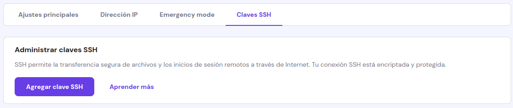
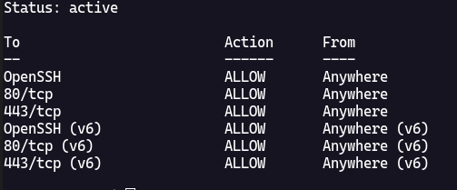
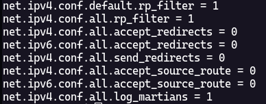
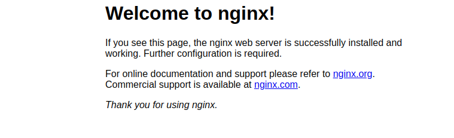

# Configuración de un servidor VPS con dominio propio

## Introducción

Este documento tiene como objetivo guiar a los usuarios a configurar un servidor VPS con un dominio propio. El servidor VPS será configurado con un sistema operativo Debian 11 y al igual que el dominio, será adquirido a través de la plataforma de Hostinger.

## Requisitos

- Cuenta en Hostinger
- Dominio adquirido en Hostinger
- Servidor VPS adquirido en Hostinger
- Conocimientos básicos de Linux

## Configuración del servidor VPS

### Acceso al servidor

Una vez adquirido el servidor VPS, se debe acceder a él a través de SSH. Para ello, debemos de generar una llave SSH en nuestro equipo local y agregarla al servidor. Para generar la llave SSH, ejecutamos el siguiente comando en la terminal de nuestro equipo local:

```bash
ssh-keygen -t rsa -b 4096 -C "email@correo.com" -f ~/.ssh/id_rsa
```
> - `ssh-keygen` es el comando para generar una llave SSH
> - `-t rsa` indica que la llave será de tipo RSA
> - `-b 4096` indica que la llave tendrá 4096 bits
> - `-C "email@correo.com"` es un comentario que se agrega a la llave para identificarla más fácilmente
> - `-f ~/.ssh/id_rsa` indica que la llave se guardará en el directorio `~/.ssh` con el nombre `id_rsa`

El comando anterior generará una llave SSH con el nombre `id_rsa` en el directorio `~/.ssh`. Es importante que reemplacemos `email@correo.com` por nuestro correo electrónico real y que asignemos una contraseña a la llave para mayor seguridad.

Una vez generada la llave SSH, debemos de agregarla al servidor VPS. Para ello, nos vamos a la sección `Claves SSH` en el panel de ajustes del servidor VPS en Hostinger y agregamos la llave pública `~/.ssh/id_rsa.pub` que acabamos de generar.



Para mayor comodidad, en nuestro archivo `~/.ssh/config` agregamos la siguiente configuración:

```bash
Host vps
    HostName #IP_DEL_SERVIDOR
    User #USUARIO
    IdentityFile ~/.ssh/id_rsa
```

Reemplazamos `#IP_DEL_SERVIDOR` por la IP del servidor VPS y `#USUARIO` por el usuario que utilizaremos para acceder al servidor, que por defecto es `root`.

Para acceder al servidor, ejecutamos el siguiente comando en la terminal de nuestro equipo local:
```bash
ssh vps
```
La primera vez que nos conectemos al servidor, se nos pedirá que confirmemos la conexión escribiendo `yes` y presionando la tecla `Enter`. Luego, se nos pedirá la contraseña de la llave SSH que asignamos al momento de generarla. Una vez ingresada la contraseña, se nos dará acceso al servidor.

### Configuración inicial

Una vez dentro del servidor, ejecutamos los siguientes comandos para actualizar el sistema.

```bash
sudo apt update
sudo apt upgrade
```
> Al ser una distribución de Linux basada en Debian, utilizamos `apt` para instalar y actualizar paquetes.

Esto actualizará el sistema y nos pedirá confirmación para instalar las actualizaciones. Escribimos `y` y presionamos la tecla `Enter` para confirmar la instalación.

### Seguridad del servidor

La seguridad del servidor es un aspecto fundamental que no debemos de pasar por alto. A continuación, se presentan algunas recomendaciones para mejorar la seguridad del servidor.

#### Deshabilitar el acceso por contraseña

Para mejorar la seguridad del servidor, deshabilitamos el acceso por contraseña y permitimos el acceso únicamente por llaves SSH. Para ello, nos dirigimos al archivo `/etc/ssh/sshd_config` con el siguiente comando:

```bash
sudo nvim /etc/ssh/sshd_config
```

> `nvim` es un editor de texto que utilizaremos para editar el archivo. Si no está instalado, podemos instalarlo ejecutando `sudo apt install neovim`. Si no queremos instalar `nvim`, podemos utilizar `nano` o cualquier otro editor de texto.

Dentro del archivo, buscamos las siguientes líneas:

```bash
PasswordAuthentication yes
challengeResponseAuthentication yes
UsePAM yes
```

Y las reemplazamos por:

```bash
PasswordAuthentication no
challengeResponseAuthentication no
UsePAM no
```

Guardamos los cambios y salimos del editor. Luego, reiniciamos el servicio SHH con el siguiente comando:

```bash
sudo systemctl restart sshd
```

#### Deshabilitar el acceso al usuario root y crear un nuevo usuario

El usuario `root` tiene permisos de administrador en el servidor, por lo que es un objetivo común para los atacantes. Por esta razón, deshabilitamos el acceso al usuario `root` y creamos un nuevo usuario con permisos de administrador.

Para añadir un nuevo usuario, ejecutamos el siguiente comando:

```bash
sudo adduser #NUEVO_USUARIO
```

> Reemplazamos `#NUEVO_USUARIO` por el nombre del nuevo usuario.

Cuando le damos enter, se nos pedirá que asignemos una contraseña al nuevo usuario y que ingresemos información adicional como el nombre completo, número de teléfono, etc. Esta información es opcional, por lo que podemos presionar la tecla `Enter` para dejar los campos vacíos.

Una vez creado el nuevo usuario, le asignamos permisos de administrador con el siguiente comando:

```bash
sudo usermod -aG sudo #NUEVO_USUARIO
```

> Reemplazamos `#NUEVO_USUARIO` por el nombre del nuevo usuario.

Para verificar que el nuevo usuario se ha creado correctamente, ejecutamos el siguiente comando:

```bash
su - #NUEVO_USUARIO
```

> Reemplazamos `#NUEVO_USUARIO` por el nombre del nuevo usuario.

Si el comando se ejecuta correctamente, se nos pedirá la contraseña del nuevo usuario y se nos dará acceso a la cuenta del nuevo usuario.

Ahora vamos a copiar la llave SSH que generamos en nuestro equipo local al nuevo usuario. Para ello, creamos el directorio `~/.ssh` en la cuenta del nuevo usuario con el siguiente comando:

```bash
mkdir ~/.ssh
```

Ingresamos al directorio `~/.ssh` y creamos el archivo `authorized_keys` con el siguiente comando:

```bash
nvim ~/.ssh/authorized_keys
```

Dentro del archivo `authorized_keys`, pegamos la llave pública `~/.ssh/id_rsa.pub` que generamos en nuestro equipo local. Guardamos los cambios, salimos del editor y con un `exit` salimos de la cuenta del nuevo usuario.

Ahora que hemos creado un nuevo usuario y le hemos asignado permisos de administrador, deshabilitamos el acceso al usuario `root`. Ingresamos al archivo `/etc/ssh/sshd_config` con el siguiente comando:

```bash
sudo nvim /etc/ssh/sshd_config
```

Dentro del archivo, buscamos la siguiente línea:

```bash
PermitRootLogin yes
```

Y la reemplazamos por:

```bash
PermitRootLogin no
```

Una vez hecho esto, guardamos los cambios y salimos del editor. Luego, reiniciamos el servicio SHH con el siguiente comando:

```bash
sudo systemctl restart sshd
```

Para verificar que el nuevo usuario tiene acceso al servidor, salimos del servidor con el comando `exit` y volvemos a ingresar al servidor con el nuevo usuario. Para ello necesitamos modificar el archivo `~/.ssh/config` en nuestro equipo local con la siguiente configuración:

```bash
Host vps
    HostName #IP_DEL_SERVIDOR
    User #NUEVO_USUARIO
    IdentityFile ~/.ssh/id_rsa
```

> Reemplazamos `#NUEVO_USUARIO` por el nombre del nuevo usuario.

Ahora, para acceder al servidor, ejecutamos el siguiente comando en la terminal de nuestro equipo local:

```bash
ssh vps
```

Al ejecutar el comando, se nos pedirá la contraseña de la llave SSH que asignamos al momento de generarla. Una vez ingresada la contraseña, se nos dará acceso al servidor con el nuevo usuario.

#### Configuración del cortafuegos

El cortafuegos es una herramienta que nos permite controlar el tráfico de red que entra y sale del servidor. Para configurar el cortafuegos, utilizamos `ufw`, para instalarlo ejecutamos el siguiente comando:

```bash
sudo apt install ufw
```

Una vez instalado, habilitamos las conexiones SSH con el siguiente comando:

```bash
sudo ufw allow OpenSSH
```

Luego, habilitamos las conexiones HTTP y HTTPS con los siguientes comandos:

```bash
sudo ufw allow 80/tcp
sudo ufw allow 443/tcp
```

Finalmente, habilitamos el cortafuegos con el siguiente comando:

```bash
sudo ufw enable
```
> Nos avisa que el cortafuegos puede bloquear nuestra conexión SSH, escribimos `y` y presionamos la tecla `Enter` para confirmar.

Para verificar que el cortafuegos se ha configurado correctamente, ejecutamos el siguiente comando:

```bash
sudo ufw status
```

Si todo se ha configurado correctamente, se nos mostrará un mensaje similar al siguiente:



Lo siguiente es configurar el cortafuegos para que deniegue todo el tráfico entrante y permita todo el tráfico saliente. Para ello, ejecutamos los siguientes comandos:

```bash
sudo ufw default deny incoming
sudo ufw default allow outgoing
```

Para finalizar, reiniciamos ufw con el siguiente comando:

```bash
sudo ufw reload
```

Para verificar que todo ha sido configurado correctamente, aun podemos acceder al servidor salimos del servidor con el comando `exit` y volvemos a ingresar al servidor. Si todo se ha configurado correctamente, se nos dará acceso al servidor con el nuevo usuario.

#### Configuración para ataques MITM

> [!WARNING]
> Es importante tener en cuenta que la siguiente configuración modificará archivos del sistema y un error en la configuración puede dejar el servidor inaccesible.

Los ataques MITM son un tipo de ataque que se produce cuando un atacante se interpone entre el cliente y el servidor para interceptar y modificar el tráfico entre ellos. Para evitar este tipo de ataques, deshabilitamos el reenvío de paquetes en el servidor.

Necesitamos modificar el archivo `/etc/sysctl.conf` con el siguiente comando:

```bash
sudo nvim /etc/sysctl.conf
```

Dentro del archivo, buscamos las siguientes líneas para descomentarlas:

```bash
#net.ipv4.conf.default.rp_filter=1
#net.ipv4.conf.all.rp_filter=1
#net.ipv4.conf.all.accept_redirects=0
#net.ipv6.conf.all.accept_redirects=0
#net.ipv4.conf.all.send_redirects=0
#net.ipv4.conf.all.accept_source_route=0
#net.ipv6.conf.all.accept_source_route=0
#net.ipv4.conf.all.log_martians=1
```

Guardamos los cambios y salimos del editor. Luego, ejecutamos el siguiente comando para aplicar los cambios:

```bash
sudo sysctl -p
```

Si la configuración se ha aplicado correctamente, nos mostrará un mensaje similar al siguiente:



#### Configuración para ataques DDoS

Los ataques DDoS son un tipo de ataque que tiene como objetivo saturar la red del servidor con una gran cantidad de tráfico para dejarlo inaccesible. Para evitar este tipo de ataques, instalamos `fail2ban` que es una herramienta que monitorea los logs del servidor y bloquea las direcciones IP que intentan acceder al servidor de forma maliciosa.

Para instalar `fail2ban`, ejecutamos el siguiente comando:

```bash
sudo apt install fail2ban
```

Una vez instalado, habilitamos el servicio con el siguiente comando:

```bash
sudo systemctl enable fail2ban
```

Luego, iniciamos el servicio con el siguiente comando:

```bash
sudo systemctl start fail2ban
```

Para verificar que `fail2ban` se ha instalado correctamente, ejecutamos el siguiente comando:

```bash
sudo systemctl status fail2ban
```

#### Finalización de la configuración para la seguridad del servidor

Una vez que hemos aplicado todas las configuraciones de seguridad, reiniciamos el servidor con el siguiente comando:

```bash
sudo reboot
```

verificamos que el firewall y `fail2ban` se han iniciado correctamente con el siguiente comando:

```bash
sudo ufw status
sudo systemctl status fail2ban
```

Una vez que el servidor se ha reiniciado, volvemos a ingresar al servidor con el nuevo usuario. Si todo se ha configurado correctamente, se nos dará acceso al servidor con el nuevo usuario.

## Configuración de la aplicación web

### Instalación de Nginx

> Nginx es uno de los servidores web más populares del mundo y se utiliza para servir contenido web. Pero si quieres usar Apache o cualquier otro servidor web, puedes hacerlo.

Para instalar Nginx, ejecutamos el siguiente comando:

```bash
sudo apt install nginx
```

Ahora que Nginx se ha instalado, necesitamos permitir Nginx a través del cortafuegos con el siguiente comando:

```bash
sudo ufw allow 'Nginx HTTP'
```

Para verificar que Nginx se ha instalado correctamente, ingresamos la IP del servidor en el navegador web. Si todo se ha configurado correctamente, se nos mostrará la página de bienvenida de Nginx.



### Configuración para la aplicación web

En este ejemplo, desplegaremos una aplicación web desarrollada en Node.js, en especifico crearemos una aplicación estática con `vite`. Para ello, necesitamos instalar Node.js en el servidor.

Para instalar Node.js, ejecutamos los siguientes comandos:

```bash
sudo apt install nodejs
sudo apt install npm
```

> [!TIP]
> Si quieres instalar nodejs de otra forma, puedes hacerlo. Puedes instalar nodejs con `nvm` o `n` que son herramientas que nos permiten instalar y gestionar varias versiones de Node.js.

Para verificar que Node.js se ha instalado correctamente, ejecutamos los siguientes comandos:

```bash
node -v
npm -v
```

Si Node.js se ha instalado correctamente, se nos mostrará la versión de Node.js y npm.

### Creación de un virtual host

Un virtual host es un método que nos permite alojar varios dominios en un solo servidor. En este caso, crearemos un virtual host para alojar nuestra aplicación web.

Necesitamos crear un nuevo archivo de configuración para el virtual host con el siguiente comando:

```bash
sudo nvim /etc/nginx/sites-available/nombre-de-tu-aplicacion.conf
```

Dentro del archivo, agregamos la siguiente configuración:

```bash
server {
    listen 80;
    server_name #IP_DEL_SERVIDOR;
    root /var/www/nombre-de-tu-aplicacion/archivos_estáticos; # Ruta de la aplicación donde se encuentran los archivos estáticos de la aplicación.
    index index.html;

    access_log /var/log/nginx/nombre-de-tu-aplicacion.access.log;
    error_log /var/log/nginx/nombre-de-tu-aplicacion.error.log;

    location / {
        try_files $uri /index.html =404;
    }
}
```

Reemplazamos `#IP_DEL_SERVIDOR` por la IP del servidor y `nombre-de-tu-aplicacion` por el nombre de la aplicación.

> [!WARNING]
> Es importante tener en cuenta que la aplicación esta hecha con `vite` y los archivos estáticos se encuentran en la carpeta `dist` en la raíz del proyecto. Si la aplicación esta hecha con otro framework o librería, es necesario cambiar la ruta de los archivos estáticos.

Guardamos los cambios y salimos del editor. Luego, creamos un enlace simbólico del archivo de configuración en el directorio `sites-enabled`. Pero antes, necesitamos quitar el enlace simbólico del archivo de configuración por defecto con el siguiente comando:

```bash
sudo unlink /etc/nginx/sites-enabled/default
```

Luego, creamos el enlace simbólico con el siguiente comando:

```bash
sudo ln -s /etc/nginx/sites-available/nombre-de-tu-aplicacion.conf /etc/nginx/sites-enabled/
```

Para verificar que el enlace simbólico se ha creado correctamente, ejecutamos el siguiente comando:

```bash
ls -al /etc/nginx/sites-enabled/
```

### Creación de la aplicación web

Si ya tienes una aplicación web desarrollada, puedes subir los archivos estáticos de la aplicación a la carpeta `/var/www/nombre-de-tu-aplicacion/archivos_estáticos` en el servidor.

Primero nos dirigimos a la carpeta `/var/www` con el siguiente comando:
```bash
cd /var/www
```

Luego, creamos una aplicación de ejemplo con `vite` con los siguientes comandos:

```bash
npm create vite@latest
cd nombre-de-tu-aplicacion
npm install
npm run build
```

Para verificar que la apliacación si ha creado correctamente, ejecutamos el siguiente comando:

```bash
ls -al /var/www/nombre-de-tu-aplicacion
```

Si la aplicación se ha creado correctamente, se nos mostrará una lista de archivos y carpetas.


### Reinicio de Nginx

Una vez que hemos creado el virtual host y subido los archivos estáticos de la aplicación, reiniciamos Nginx con el siguiente comando:

```bash
sudo service nginx reload
```

Para verificar que el virtual host se ha creado correctamente, ingresamos con la IP del servidor en el navegador web. Si todo se ha configurado correctamente, se nos mostrará la aplicación web.

